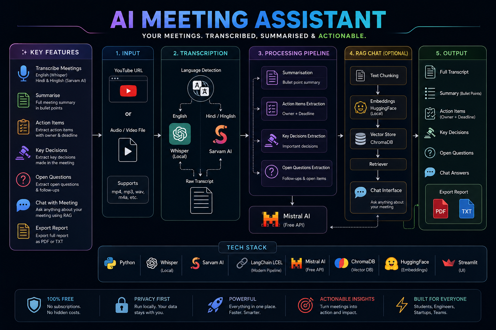

<p align="center">
  
</p>

<h1 align="center">🎙️ AI Meeting Assistant</h1>

<p align="center">
  Transcribe • Summarize • Extract Insights • Chat with Meetings
</p>

<p align="center">
  Built completely with Python using FREE AI tools.
</p>

---

## ✨ Overview

AI Meeting Assistant is a complete end-to-end meeting intelligence system that can:

- Transcribe meetings from audio, video, or YouTube links
- Support English, Hindi, and Hinglish transcription
- Generate clean AI summaries
- Extract action items, decisions, and open questions
- Enable RAG-powered chat with meetings
- Export reports as PDF or TXT

---

# 🚀 Features

## 🎧 Meeting Input
- YouTube URL support
- Upload audio/video files
- Supports:
  - `mp3`
  - `mp4`
  - `wav`
  - `m4a`
  - `mov`

---

## 📝 Smart Transcription

### English Meetings
- Powered by **OpenAI Whisper**
- Runs locally
- No paid API required

### Hindi & Hinglish Meetings
- Powered by **Sarvam AI**
- Better regional language understanding

---

## 🧠 AI Processing Pipeline

The assistant automatically analyzes meetings and extracts:

- ✅ Bullet-point summaries
- ✅ Action items
- ✅ Owner & deadlines
- ✅ Key decisions
- ✅ Open questions
- ✅ Follow-ups

---

## 💬 Chat With Your Meeting (RAG)

Ask questions like:

```text
What decisions were made?
Who is responsible for deployment?
What are the pending tasks?
```

Powered by:

- ChromaDB
- HuggingFace Embeddings
- LangChain LCEL
- Mistral AI

---

# 🛠️ Tech Stack

<div align="center">

| Technology | Purpose |
|---|---|
| Python | Core Backend |
| Whisper AI | English Transcription |
| Sarvam AI | Hindi/Hinglish Transcription |
| LangChain LCEL | AI Pipelines |
| Mistral AI | LLM |
| ChromaDB | Vector Database |
| HuggingFace Embeddings | Local Embeddings |
| Streamlit | UI |

</div>

---

# ⚡ Workflow

```text
Input
   ↓
Transcription
   ↓
Meeting Analysis
   ↓
RAG + Vector Search
   ↓
Chat & Insights
   ↓
Export Report
```

---

# 📂 Project Structure

```text
.
├── core/
├── utils/
├── .gitignore
├── project_diagram.png
├── requirements.txt
└── test.py
```

---

# 📦 Installation

## Clone Repository

```bash
git clone <your-repo-url>
cd <project-folder>
```

---

## Install Dependencies

```bash
pip install -r requirements.txt
```

---

# ▶️ Run Project

```bash
streamlit run app.py
```

---

# 📤 Export Options

The assistant can export:

- 📄 PDF Reports
- 📝 TXT Reports

---

# 🔥 Why This Project?

Most AI meeting assistants are expensive monthly subscriptions.

This project gives you:

- Full local processing
- Free AI stack
- RAG-powered meeting memory
- Multi-language support
- Complete ownership of your data

---

# 🧩 Future Improvements

- Speaker Diarization
- Live Meeting Transcription
- Team Workspace
- Cloud Deployment
- Real-time Meeting Chat
- Calendar Integration

---

# 📜 License

MIT License

---

<p align="center">
  Built with ❤️ using Python + Open Source AI
</p>
